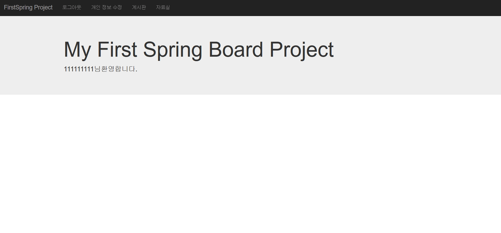
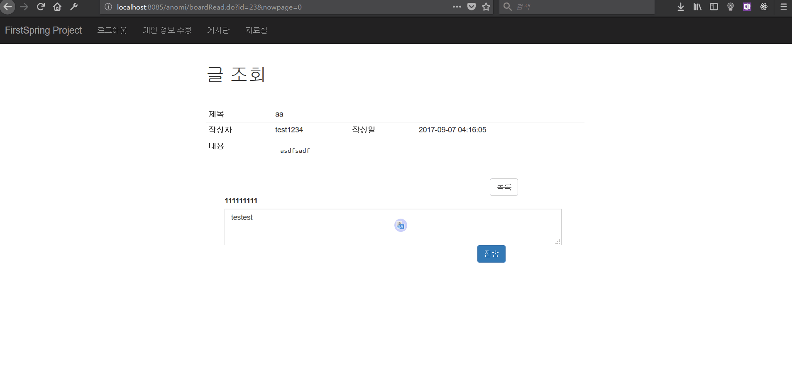
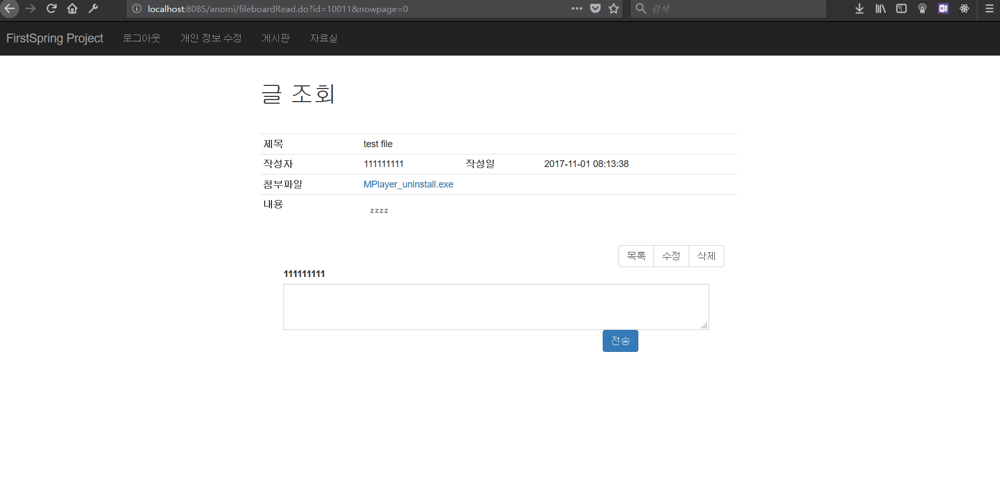

Spring MVC 커뮤니티
============================

# 프로젝트 소개 #

1. Spring 프레임워크를 사용한 커뮤니티 사이트
2. javascript를 이용한 Client Side 유효성 검사
3. spring-validation을 이용한 Server Side 유효성 검사
4. mybatis를 이용한 DB 연동
5. 파일 업로드 기능
6. jquery를 이용한 댓글 기능(ajax)
7. 파일 업로드와 다운로드 기능 구현
-------------------------------------------------
## 모든 구현 과정은 블로그에 연재되고 있습니다.
<http://www.anomie7.xyz/> 

## 게시판 CRUD

## 덧글 CRUD

## 자료실
### 1. 파일 첨부와 다운로드

###2. 파일 첨부 수정
